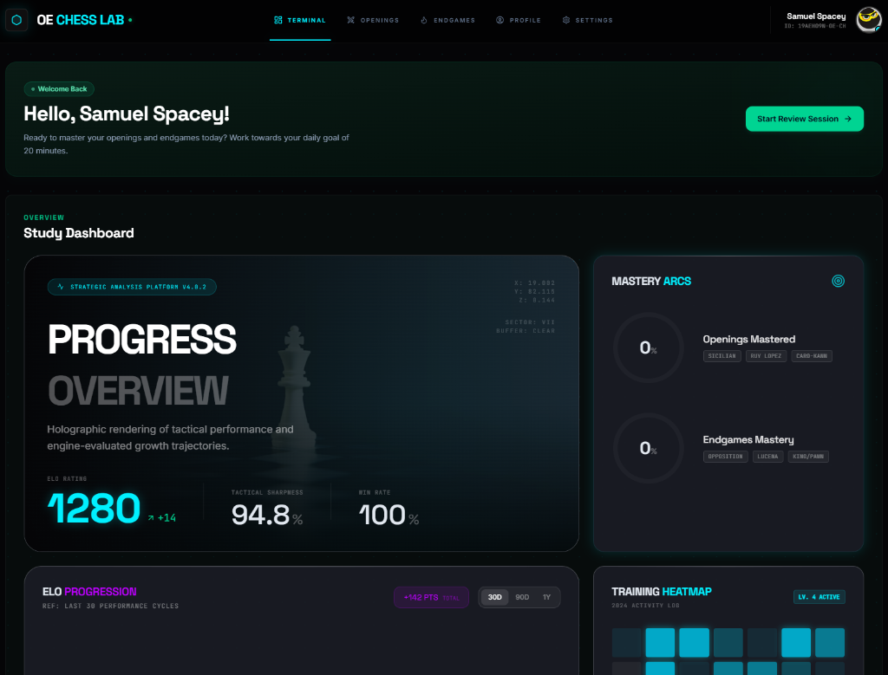

# OE Chess Lab

A premium, interactive chess study web application designed to help players master openings and endgames through interactive practice, a schema-verified 7-tier curriculum, and off-thread Stockfish engine analysis.



---

## ✨ Features

- **Interactive Training Dashboard**: Track your ELO progression, daily activity heatmaps, and opening/endgame mastery arcs in a gorgeous, glassmorphic terminal interface.
- **7-Tier Opening Curriculum**: A comprehensive, modular database modeled after public chess theory and verified by automated unit tests.
- **Real-Time Stockfish Integration**: Analyze positions with a local Stockfish instance running on a Web Worker off the main thread for lag-free interaction.
- **Move-by-Move Opening Trainer**: Practice opening lines with interactive HUD indicators, hiding future moves to ensure active recall, and displaying a `?` placeholder for the current move.
- **Endgame Trainer**: Recreate critical endgame scenarios (King and Pawn, Lucena, Opposition) and verify wins or draws dynamically.
- **Spaced-Repetition System (SRS)**: Automatically schedules reviews based on your mastery score, response times, and mistake counts.

---

## 🏗️ Technical Architecture & Stack

The application follows a clean, feature-driven modular structure built with:

- **Framework**: Next.js 16 (App Router, Server & Client Components)
- **Language**: TypeScript (Strict type checking)
- **Styling**: Tailwind CSS v4 (Vanilla CSS controls, Glassmorphism, animations)
- **Database & Auth**: Firebase (Firestore database, client authentication, and user preferences sync)
- **Chess Logic**: `chess.js` (v1.4.0) for move validation and FEN state parsing
- **Chessboard UI**: `react-chessboard` (v5.10.0)
- **Engine**: Stockfish (WASM version run asynchronously in a Web Worker)
- **Testing**: Vitest for automated curriculum schema validation and move integrity tests

---

## 📂 Curriculum Structure

The openings database is validated against strict JSON schemas:
- **Concepts Database (`data/concepts.json`)**: 25+ fundamental tactical and positional principles.
- **Traps Database (`data/traps.json`)**: Common opening traps (e.g. Blackburne Shilling, Légal's Trap, Noah's Ark) with verified refutations.
- **Italian Game Repertoire (`data/openings/white/italian/`)**: Features 7 difficulty levels (Beginner to Legend) mapping moves, prerequisites, continuation IDs, and FEN board states.

---

## 🚦 Getting Started

### Prerequisites
Make sure you have Node.js installed on your system.

### Installation
1. **Clone the Repository**:
   ```bash
   git clone https://github.com/GODMODE25/lotus-chess-clone.git
   cd lotus-chess-clone
   ```
2. **Install Dependencies**:
   ```bash
   npm install
   ```
3. **Run Development Server**:
   ```bash
   npm run dev
   ```
4. **Run Curriculum Integrity Tests**:
   ```bash
   npx vitest run
   ```

---

## ⚙️ Firebase Setup
Create a `.env.local` file at the root of the project and add your Firebase credentials:
```env
NEXT_PUBLIC_FIREBASE_API_KEY=your_api_key
NEXT_PUBLIC_FIREBASE_AUTH_DOMAIN=your_auth_domain
NEXT_PUBLIC_FIREBASE_PROJECT_ID=your_project_id
NEXT_PUBLIC_FIREBASE_STORAGE_BUCKET=your_storage_bucket
NEXT_PUBLIC_FIREBASE_MESSAGING_SENDER_ID=your_sender_id
NEXT_PUBLIC_FIREBASE_APP_ID=your_app_id
```
