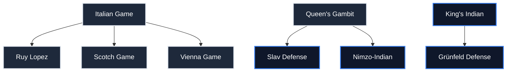

# Opening Curriculum Roadmap

This document outlines the curriculum generation path, dependency graph, and future milestones for expanding the repertoire database.

---

## 1. Opening Dependency Graph

To optimize studying efficiency, the curriculum recommends a logical progression where structural and tactical themes build upon one another:

---

## 2. Repertoire Expansion Schedule

The database will be expanded incrementally. Each opening will undergo identical 7-tier mastery modeling, schema verification, and engine play-through validation:

### Phase 1: White Openings (Core Systems)
- [x] **Italian Game** (1.e4 e5 2.Nf3 Nc6 3.Bc4)
- [x] **Ruy Lopez** (1.e4 e5 2.Nf3 Nc6 3.Bb5)
- [x] **Queen's Gambit** (1.d4 d5 2.c4)
- [x] **London System** (1.d4 Nf6 2.Nf3 d5 3.Bf4)
- [x] **English Opening** (1.c4)

### Phase 2: Black Openings (Core Defences)
- [x] **Sicilian Defense** (1.e4 c5)
- [ ] **French Defense** (1.e4 e6)
- [ ] **Caro-Kann Defense** (1.e4 c6)
- [ ] **King's Indian Defense** (1.d4 Nf6 2.c4 g6)

### Phase 3: Advanced White Openings (Catalan & Open Games)
- [ ] **Scotch Game** (1.e4 e5 2.Nf3 Nc6 3.d4)

- [ ] **Catalan Opening** (1.d4 Nf6 2.c4 e6 3.g3)
- [ ] **Reti Opening** (1.Nf3 d5 2.c4)

---

## 3. Curriculum Progression Rules

1. **Prerequisite Unlocking**: A student must complete all lines in a level's prerequisite list before they can start studying the target line. [Implemented & Tested]
2. **Graduation Requirements**: To graduate a tier, students must achieve the accuracy target specified in `metadata.json` (e.g. 75%+ accuracy in review sessions). [Implemented & Tested]
3. **Mastery XP**: Completing lines awards XP points proportional to the line's move depth and difficulty multiplier. [Implemented & Tested]

---

## 4. Agent Skills (Curriculum Authoring)

| Skill | Purpose |
|-------|---------|
| `build-opening-tree` | PGN → variation tree (nodes, branches, parents, reference validation) |
| `create-opening-course` | Tree → tier JSON export + curriculum validation |
| `opening-course-generator` | Scaffold + pre-flight legality checker + pitfalls checklist for 7-tier opening courses (created this session; used for Sicilian Defense) |

---

## Handoff to Next Agent

**Last updated:** 2026-07-20

**Completed this session (2026-07-20 — Skill + Sicilian Defense):**
- Created the **`opening-course-generator`** agent skill (`.agents/skills/opening-course-generator/SKILL.md`) with scaffold, pre-flight legality checker, and pitfalls checklist, plus the shared library `scripts/opening-course-lib.js` (`buildLine`, `validateAllLines`, `writeCourse`, `countLines`), the scaffold `scripts/generate-opening-template.js`, and the standalone checker `scripts/preflight-check-opening.js`.
- Fixed a real bug in `scripts/opening-course-lib.js`: `validateAllLines` now wraps `chess.move()` in try/catch because chess.js v1.x **throws** on illegal moves (it does not return falsy). The checker now reports every illegal line with tier/id/ply/FEN/legal moves instead of crashing with a raw `Error: Invalid move`.
- Generated the full **Sicilian Defense** (black) 7-tier opening course via `scripts/generate-sicilian-defense.js` (67 lines: 5/8/10/12/12/10/10 across Beginner→Legend). Covers Open/Najdorf, Sveshnikov, Dragon, Classical, Rossolimo, Kan, Closed, Alapin, Four Knights, and more.
- Fixed ~22 illegal-move bugs in the Sicilian generator during iterative pre-flight loops: ambiguous `Nb5`→`Ndb5` and `Nd2`→`Nfd2`; illegal castling `O-O`→`Nf6`/`Be6`/`Be7` (f8 bishop blocked the rook); `e6`→`Be6` (e-pawn already on e5); `N5c3`→`Nd4 Nxd4 Qxd4` (c3 occupied); `Bxd4`→`Qxd4`/`Be6`; `Qd3`→`Qa5`; and reworked the legend Rossolimo to `10.c3 dxc3 11.Nxc3`. Also cleared a dangling `continuationIds` (`sicilian-master-four-knights` → `[]`).
- Re-validated the entire curriculum dataset with `node scripts/validate-curriculum.js` — **ALL TESTS PASSED SUCCESSFULLY (Clean curriculum dataset)**, including the new Sicilian Defense.

**Completed in prior sessions:**
- Generated the full **Queen's Gambit** (white) 7-tier opening course via `scripts/generate-queens-gambit.js` (chess.js-validated move sequences, FENs, PGN, UCI).
- Fixed multiple illegal move sequences in the generator (e.g. `axb6` with the a-pawn already on a6, `Bxe4` from g3, pinned `Ne4`, `Bxc3` from f5, black `O-O` blocked by the g8-knight) and two dangling `continuationIds` references.
- Validated the entire curriculum dataset with `node scripts/validate-curriculum.js` — **ALL TESTS PASSED SUCCESSFULLY (Clean curriculum dataset)**, including the new Queen's Gambit (5/8/10/12/12/10/10 lines across Beginner→Legend).
- Generated the full **London System** (white) 7-tier opening course via `scripts/generate-london-system.js` (chess.js-validated move sequences, FENs, PGN, UCI). Covers 1.d4 Nf6 2.Nf3 d5 3.Bf4 against ...c5, ...e6, ...c6, ...g6, ...Bf5, ...Nc6, ...b6, ...Bg4, ...Qb6, ...Ne4 with e5-outpost, c4-break, bishop-pair, and f4-space plans.
- Fixed six illegal-move bugs in the London generator (kingside castling with the light bishop still on f1, `Bd6` blocked by the e7 pawn in the ...b6 fianchetto, `Rac8` with the c8 bishop trapped, the dark bishop on f4 blocking the f4 pawn, undeveloped f8 bishop blocking castling, and a move-parity break in the ...b6 legend line).
- Fixed two generator bugs: tier files now include the top-level `openingId` field and `startingFen` is set to the final position after the moves (was the initial position). Replaced the invalid `queens` concept with `space-advantage` (3 lines) and set two dangling `continuationIds` (`london-master-vs-Bg4`, `london-master-vs-Ne4`) to `[]` since no master-tier continuation was authored.
- Re-validated the entire curriculum dataset with `node scripts/validate-curriculum.js` — **ALL TESTS PASSED SUCCESSFULLY (Clean curriculum dataset)**, including the new London System (5/8/10/12/12/10/10 lines across Beginner→Legend).
- Generated the full **English Opening** (white) 7-tier opening course via `scripts/generate-english-opening.js` (chess.js-validated move sequences, FENs, PGN, UCI). Covers 1.c4 against 1...e5 (Botvinnik/reversed Sicilian), 1...c5 (symmetric/Hedgehog), 1...Nf6 (Anglo-Grünfeld/KID-reversed/Carlsbad), 1...e6 (QID-reversed/Carlsbad), 1...f5 (Anglo-Dutch) across 67 lines (5/8/10/12/12/10/10).
- Fixed several illegal-move bugs in the English generator: `Bd3` with the f1 bishop still blocked by the e2 pawn (after `Bg5`), white `O-O` attempted while the f1 bishop was still home (inserted `e3`/`Bd3` before castling, with a black move in between), `d6` with the d-pawn already traded off in the Anglo-Grünfeld line, `Nde2` with the e2 pawn still present (changed to `Nc2`), and an ambiguous `Re1` after castling (disambiguated to `Rfe1`). Also fixed a dangling `continuationIds` reference (`english-expert-Nf6-e6-d4` → `english-expert-Nf6-e6-d4-deep`) and a mismatched explanation in the Anglo-Grünfeld legend line.
- Re-validated the entire curriculum dataset with `node scripts/validate-curriculum.js` — **ALL TESTS PASSED SUCCESSFULLY (Clean curriculum dataset)**, including the new English Opening (5/8/10/12/12/10/10 lines across Beginner→Legend).

**Created files:**
- [generate-queens-gambit.js](scripts/generate-queens-gambit.js)
- [data/openings/white/queens-gambit/metadata.json](data/openings/white/queens-gambit/metadata.json)
- [data/openings/white/queens-gambit/beginner.json](data/openings/white/queens-gambit/beginner.json)
- [data/openings/white/queens-gambit/novice.json](data/openings/white/queens-gambit/novice.json)
- [data/openings/white/queens-gambit/intermediate.json](data/openings/white/queens-gambit/intermediate.json)
- [data/openings/white/queens-gambit/advanced.json](data/openings/white/queens-gambit/advanced.json)
- [data/openings/white/queens-gambit/expert.json](data/openings/white/queens-gambit/expert.json)
- [data/openings/white/queens-gambit/master.json](data/openings/white/queens-gambit/master.json)
- [data/openings/white/queens-gambit/legend.json](data/openings/white/queens-gambit/legend.json)
- [generate-london-system.js](scripts/generate-london-system.js)
- [data/openings/white/london-system/metadata.json](data/openings/white/london-system/metadata.json)
- [data/openings/white/london-system/beginner.json](data/openings/white/london-system/beginner.json)
- [data/openings/white/london-system/novice.json](data/openings/white/london-system/novice.json)
- [data/openings/white/london-system/intermediate.json](data/openings/white/london-system/intermediate.json)
- [data/openings/white/london-system/advanced.json](data/openings/white/london-system/advanced.json)
- [data/openings/white/london-system/expert.json](data/openings/white/london-system/expert.json)
- [data/openings/white/london-system/master.json](data/openings/white/london-system/master.json)
- [data/openings/white/london-system/legend.json](data/openings/white/london-system/legend.json)
- [generate-english-opening.js](scripts/generate-english-opening.js)
- [data/openings/white/english-opening/metadata.json](data/openings/white/english-opening/metadata.json)
- [data/openings/white/english-opening/beginner.json](data/openings/white/english-opening/beginner.json)
- [data/openings/white/english-opening/novice.json](data/openings/white/english-opening/novice.json)
- [data/openings/white/english-opening/intermediate.json](data/openings/white/english-opening/intermediate.json)
- [data/openings/white/english-opening/advanced.json](data/openings/white/english-opening/advanced.json)
- [data/openings/white/english-opening/expert.json](data/openings/white/english-opening/expert.json)
- [data/openings/white/english-opening/master.json](data/openings/white/english-opening/master.json)
- [data/openings/white/english-opening/legend.json](data/openings/white/english-opening/legend.json)
- [generate-sicilian-defense.js](scripts/generate-sicilian-defense.js)
- [data/openings/black/sicilian-defense/metadata.json](data/openings/black/sicilian-defense/metadata.json)
- [data/openings/black/sicilian-defense/beginner.json](data/openings/black/sicilian-defense/beginner.json)
- [data/openings/black/sicilian-defense/novice.json](data/openings/black/sicilian-defense/novice.json)
- [data/openings/black/sicilian-defense/intermediate.json](data/openings/black/sicilian-defense/intermediate.json)
- [data/openings/black/sicilian-defense/advanced.json](data/openings/black/sicilian-defense/advanced.json)
- [data/openings/black/sicilian-defense/expert.json](data/openings/black/sicilian-defense/expert.json)
- [data/openings/black/sicilian-defense/master.json](data/openings/black/sicilian-defense/master.json)
- [data/openings/black/sicilian-defense/legend.json](data/openings/black/sicilian-defense/legend.json)
- [opening-course-lib.js](scripts/opening-course-lib.js)
- [generate-opening-template.js](scripts/generate-opening-template.js)
- [preflight-check-opening.js](scripts/preflight-check-opening.js)
- [SKILL.md](.agents/skills/opening-course-generator/SKILL.md)

**Modified files:**
- [ROADMAP.md](ROADMAP.md) (marked Sicilian Defense complete; added `opening-course-generator` skill; this handoff)
- [scripts/generate-sicilian-defense.js](scripts/generate-sicilian-defense.js) (completed truncated metadata + generation code; fixed ~22 illegal moves; cleared dangling continuationId)
- [scripts/opening-course-lib.js](scripts/opening-course-lib.js) (fixed `validateAllLines` try/catch for chess.js v1.x illegal-move throws)

**Architectural decisions:**
- Queen's Gambit course authored from standard mainline theory (Chess.com / Chessable databases) per user instruction, covering QGD, Slav, QGA, Tarrasch, Semi-Slav (Meran/Botvinnik), Ragazin, Cambridge Springs, Lasker, and Carlsbad/Exchange structures.
- All FENs/PGNs/UCI generated programmatically via chess.js to guarantee legality; no hand-written FENs.
- Two expert-tier lines (`tarrasch-symmetrical`, `qgd-orthodox-rubinstein`) are terminal (empty `continuationIds`) because no master-tier continuation was authored for them; this is valid per schema.
- The `opening-course-generator` skill standardizes opening authoring: every new opening uses `scripts/generate-opening-template.js` + `scripts/opening-course-lib.js` + `scripts/preflight-check-opening.js` before `validate-curriculum.js`. This makes the Sicilian (and future) courses reproducible by any agent.
- Sicilian Defense is the first **black** opening; `writeCourse` writes to `data/openings/black/<slug>/` (the lib derives the side directory from the `side` field).

**Blockers:**
- `npx vitest run` is broken in this environment: vitest@4.1.10 throws `TypeError: Cannot read properties of undefined (reading 'config')` at the `describe` block for ANY test file (verified with a trivial 3-line smoke test). This is a pre-existing vitest 4.1.10 / Node 22 / Windows runner bug, NOT a content defect — `validate-curriculum.js` (the authoritative curriculum integrity check) passes cleanly. Recommend downgrading vitest or fixing the runner before relying on `npm test`.

**Remaining work:**
- Phase 2: King's Indian Defense.
- Phase 3: Scotch Game, Catalan Opening, Reti Opening.
- Wire Sicilian Defense (and Queen's Gambit, London System, English Opening) into the front-end (`src/content/openingsCurated.ts`) like Italian/Ruy Lopez, once vitest is usable or via direct validation.

**Completion:** Italian Game, Ruy Lopez, Queen's Gambit, London System, English Opening (Phase 1, 100%) and Sicilian Defense (Phase 2, 1/5) curated and verified. Curriculum dataset validates cleanly via `validate-curriculum.js`. Overall: 6/25 openings (24%). The `opening-course-generator` skill is in place to accelerate the remaining 19 openings.

