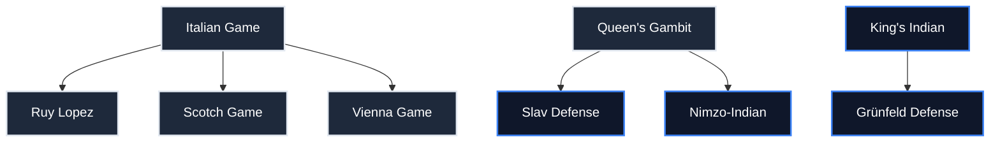

# Opening Curriculum Roadmap

This document outlines the curriculum generation path, dependency graph, and future milestones for expanding the repertoire database.

---

## 1. Opening Dependency Graph

To optimize studying efficiency, the curriculum recommends a logical progression where structural and tactical themes build upon one another:

---

## 2. Repertoire Expansion Schedule

The database will be expanded incrementally. Each opening will undergo identical 7-tier mastery modeling, schema verification, and engine play-through validation:

### Phase 1: White Openings (Core Systems)
- [x] **Italian Game** (1.e4 e5 2.Nf3 Nc6 3.Bc4)
- [ ] **Ruy Lopez** (1.e4 e5 2.Nf3 Nc6 3.Bb5)
- [ ] **Queen's Gambit** (1.d4 d5 2.c4)
- [ ] **London System** (1.d4 Nf6 2.Nf3 d5 3.Bf4)
- [ ] **English Opening** (1.c4)

### Phase 2: Black Openings (Core Defences)
- [ ] **Sicilian Defense** (1.e4 c5)
- [ ] **French Defense** (1.e4 e6)
- [ ] **Caro-Kann Defense** (1.e4 c6)
- [ ] **King's Indian Defense** (1.d4 Nf6 2.c4 g6)
- [ ] **Slav Defense** (1.d4 d5 2.c4 c6)

### Phase 3: Advanced White Openings (Catalan & Open Games)
- [ ] **Scotch Game** (1.e4 e5 2.Nf3 Nc6 3.d4)
- [ ] **Vienna Game** (1.e4 e5 2.Nc3)
- [ ] **Catalan Opening** (1.d4 Nf6 2.c4 e6 3.g3)
- [ ] **Reti Opening** (1.Nf3 d5 2.c4)
- [ ] **King's Gambit** (1.e4 e5 2.f4)

### Phase 4: Advanced Black Defences (Indian & Semi-Open Systems)
- [ ] **Nimzo-Indian Defense** (1.d4 Nf6 2.c4 e6 3.Nc3 Bb4)
- [ ] **Grünfeld Defense** (1.d4 Nf6 2.c4 g6 3.Nc3 d5)
- [ ] **Queen's Indian Defense** (1.d4 Nf6 2.c4 e6 3.Nf3 b6)
- [ ] **Scandinavian Defense** (1.e4 d5)
- [ ] **Pirc Defense** (1.e4 d6 2.d4 Nf6 3.Nc3 g6)
- [ ] **Dutch Defense** (1.d4 f5)

---

## 3. Curriculum Progression Rules

1. **Prerequisite Unlocking**: A student must complete all lines in a level's prerequisite list before they can start studying the target line.
2. **Graduation Requirements**: To graduate a tier, students must achieve the accuracy target specified in `metadata.json` (e.g. 75%+ accuracy in review sessions).
3. **Mastery XP**: Completing lines awards XP points proportional to the line's move depth and difficulty multiplier.
